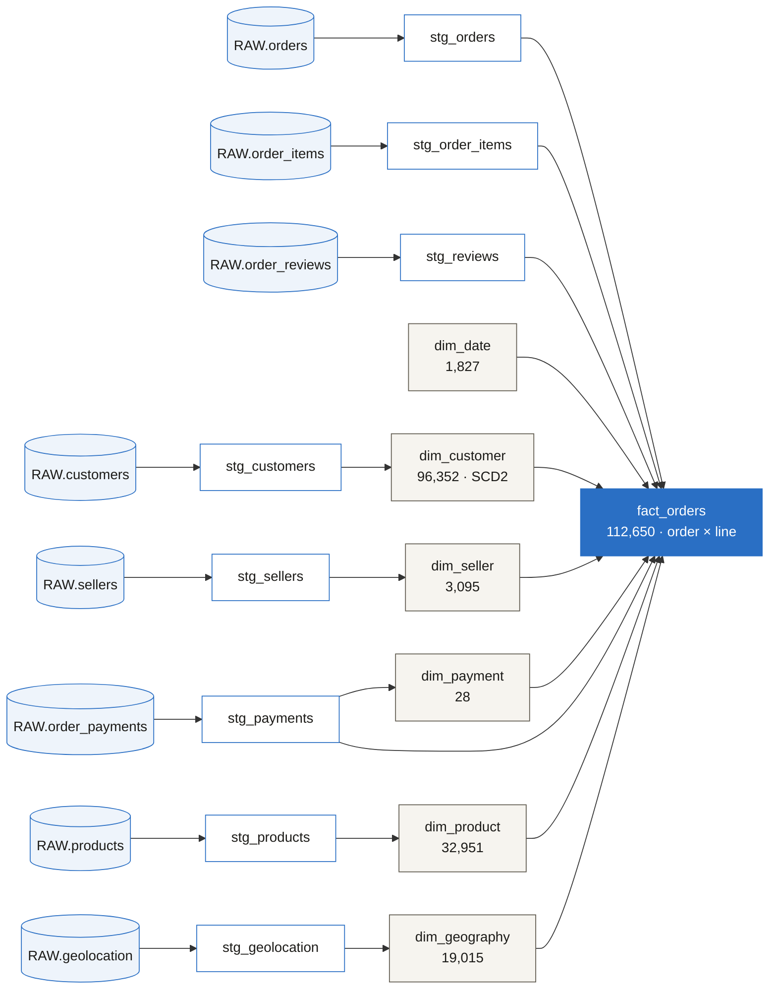

# Lineage

The dbt DAG from raw Olist tables through staging to the star schema. GitHub renders the mermaid graph below; `dbt docs generate && dbt docs serve` produces the interactive version locally.

**Reading it:** eight raw tables → eight staging views → six dimensions + one fact. `dim_date` is role-played three times on `fact_orders` (purchase / delivered / estimated); `dim_geography` is conformed across the customer and seller sides. See [`results/dbt_run.log`](../results/dbt_run.log) (15 models) and [`results/dbt_test.log`](../results/dbt_test.log) (31/31 tests passing).
